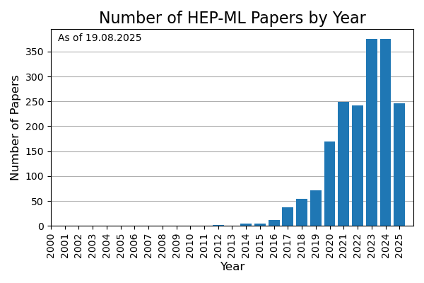

# **A Living Review of Dark Showers**

*Dark showers sit at a rich intersection of theory, phenomenology and experimental efforts. They connect different areas of theoretical physics with each other and arise from well motivated theoretical scenarios. Below is a list of papers concerning dark showers.*

The purpose of this note is to collect references for dark showers. A minimal number of categories is chosen in order to be as useful as possible. Note that papers may be referenced in more than one category.

**Last updated:** 2025-09-23
**Search period:** 2005-01-01 to present
**Total papers found:** 403

## Reviews

* [Review of strongly-coupled composite dark matter models and lattice simulations](https://inspirehep.net/literature/1448259)
  * arXiv:1604.04627 | 2016-04-19 | hep-ph
* [Review of Physics Results from the Tevatron: Searches for New Particles and Interactions](https://inspirehep.net/literature/1317647)
  * arXiv:1409.4910 | 2014-09-18 | hep-ex

## Model Building

* [Secluded Dark Composites and Remnant Binding Fields](https://inspirehep.net/literature/2929942)
  * arXiv:2506.04331 | 2025-06-06 | hep-ph
* [Scattering of dark pions in Sp(4) gauge theory](https://inspirehep.net/literature/2785259)
  * arXiv:2405.06506 | 2024-05-13 | hep-lat
* [Field theory axiverse](https://inspirehep.net/literature/2778853)
  * arXiv:2404.11642 | 2024-04-19 | hep-ph
* [Semi-visible jets, energy-based models, and self-supervision](https://inspirehep.net/literature/2731380)
  * arXiv:2312.03067 | 2023-12-07 | hep-ph
* [Scattering of dark pions in an Sp(4)-gauge theory](https://inspirehep.net/literature/2728682)
  * arXiv:2311.18549 | 2023-12-01 | hep-lat
* [Nonabelian kinetic mixing in a confining phase: a framework for composite dark photons](https://inspirehep.net/literature/2702530)
  * arXiv:2309.13105 | 2023-09-26 | hep-ph
* [Sp(2N) Lattice Gauge Theories and Extensions of the Standard Model of Particle Physics](https://inspirehep.net/literature/2648212)
  * arXiv:2304.01070 | 2023-04-04 | hep-lat
* [Composite dynamics in Sp(2N) gauge theories](https://inspirehep.net/literature/2183167)
  * arXiv:2211.09262 | 2022-11-18 | hep-lat
* [Gravitational Waves from dark composite dynamics](https://inspirehep.net/literature/2182738)
  * arXiv:2211.08877 | 2022-11-17 | hep-ph
* [Spectroscopy of $Sp(4)$ lattice gauge theory with $n_f=3$ antisymmetric fermions](https://inspirehep.net/literature/2165940)
  * arXiv:2210.08154 | 2022-10-18 | hep-lat
* [Perturbative unitarity of strongly interacting massive particle models](https://inspirehep.net/literature/2159849)
  * arXiv:2210.01393 | 2022-10-05 | hep-ph
* [Towards better discrimination and improved modelling of dark-sector showers](https://inspirehep.net/literature/2158436)
  * arXiv:2209.14964 | 2022-09-30 | hep-ph
* [Report of the Topical Group on Physics Beyond the Standard Model at Energy Frontier for Snowmass 2021](https://inspirehep.net/literature/2157249)
  * arXiv:2209.13128 | 2022-09-28 | hep-ph
* [Fate of the first-order chiral phase transition in QCD: Implications for dark QCD studied via a Nambu–Jona-Lasinio model](https://inspirehep.net/literature/2133228)
  * arXiv:2208.03975 | 2022-08-09 | hep-ph
* [Glueballs in a thermal squeezeout model](https://inspirehep.net/literature/2060136)
  * arXiv:2203.15813 | 2022-03-31 | hep-ph
* [Theory, phenomenology, and experimental avenues for dark showers: a Snowmass 2021 report](https://inspirehep.net/literature/2054250)
  * arXiv:2203.09503 | 2022-03-18 | hep-ph
* [New Indication from Quantum Chromodynamics Calling for beyond the Standard Model](https://inspirehep.net/literature/1997029)
  * arXiv:2112.13533 | 2021-12-28 | hep-ph
* [A theory of dark pions](https://inspirehep.net/literature/1949029)
  * arXiv:2110.10691 | 2021-10-22 | hep-ph
* [Dark confinement-deconfinement phase transition: a roadmap from Polyakov loop models to gravitational waves](https://inspirehep.net/literature/1840237)
  * arXiv:2101.03795 | 2021-01-12 | hep-ph
* [Spheres To Jets: Tuning Event Shapes with 5d Simplified Models](https://inspirehep.net/literature/1818161)
  * arXiv:2009.08981 | 2020-09-22 | hep-ph
* [Composite solution to the neutron lifetime anomaly](https://inspirehep.net/literature/1811764)
  * arXiv:2008.06061 | 2020-08-17 | hep-ph
* [Effective Field Theory in AdS: Continuum Regime, Soft Bombs, and IR Emergence](https://inspirehep.net/literature/1782671)
  * arXiv:2002.12335 | 2020-02-28 | hep-th
* [Lattice Gauge Theory for Physics Beyond the Standard Model](https://inspirehep.net/literature/1730601)
  * arXiv:1904.09964 | 2019-04-23 | hep-lat
* [Resolving phenomenological problems with strongly-interacting-massive-particle models with dark vector resonances](https://inspirehep.net/literature/1650126)
  * arXiv:1801.07726 | 2018-01-25 | hep-ph
* [$SU(2)$ Gauge Theory with Two Fundamental Flavours: Scalar and Pseudoscalar Spectrum](https://inspirehep.net/literature/1477592)
  * arXiv:1607.06654 | 2016-07-25 | hep-lat
* [Optical dispersion of composite particles consisting of millicharged constituents](https://inspirehep.net/literature/1473564)
  * arXiv:1607.04577 | 2016-07-04 | hep-ph
* [Diphotons at the $Z$-pole in Models of the 750 GeV Resonance Decaying to Axion-Like Particles](https://inspirehep.net/literature/1471530)
  * arXiv:1606.06375 | 2016-06-22 | hep-ph
* [SIMP from a strong U(1) gauge theory with a monopole condensation](https://inspirehep.net/literature/1467419)
  * arXiv:1606.01628 | 2016-06-07 | hep-ph
* [SU(2) gauge theory with two fundamental flavors: A minimal template for model building](https://inspirehep.net/literature/1422783)
  * arXiv:1602.06559 | 2016-02-23 | hep-lat
* [Gamma-rays from Dark Showers with Twin Higgs Models](https://inspirehep.net/literature/1418186)
  * arXiv:1601.07556 | 2016-01-29 | hep-ph
* [Electroweak interactions and dark baryons in the sextet BSM model with a composite Higgs particle](https://inspirehep.net/literature/1415123)
  * arXiv:1601.03302 | 2016-01-14 | hep-lat
* [Theory Motivation For Exotic Signatures: Prospects and Wishlist for Run II](https://inspirehep.net/literature/1411316)
  * arXiv:1512.07857 | 2015-12-25 | hep-ph
* [Interpreting the 750 GeV diphoton resonance using photon jets in hidden-valley-like models](https://inspirehep.net/literature/1410841)
  * arXiv:1512.06671 | 2015-12-22 | hep-ph
* [SIMP model at NNLO in chiral perturbation theory](https://inspirehep.net/literature/1381768)
  * arXiv:1507.01590 | 2015-07-08 | hep-ph
* [The Physics of the $\theta$-angle for Composite Extensions of the Standard Model](https://inspirehep.net/literature/1256598)
  * arXiv:1310.0954 | 2013-10-04 | hep-ph
* [A first study of Hidden Valley models at the LHC](https://inspirehep.net/literature/913347)
  * arXiv:1106.2064 | 2011-06-12 | hep-ph
* [Proceedings, 12th Workshop on What Comes Beyond the Standard Models?](https://inspirehep.net/literature/841034)
  * arXiv:0912.4532 | 2009-12-23 | hep-ph
* [Gauge Extensions of Supersymmetric Models and Hidden Valleys](https://inspirehep.net/literature/811237)
  * arXiv:0901.2613 | 2009-01-19 | hep-ph
* [Proceedings, 11th Workshop on What Comes Beyond the Standard Models?](https://inspirehep.net/literature/804131)
  * arXiv:0812.0510 | 2008-12-02 | hep-ph
* [Why Unparticle Models with Mass Gaps are Examples of Hidden Valleys](https://inspirehep.net/literature/776786)
  * arXiv:0801.0629 | 2008-01-06 | hep-ph

## Dark Matter

* [Inelastically Decoupling Dark Matter](https://inspirehep.net/literature/2958244)
  * arXiv:2508.04772 | 2025-08-08 | hep-ph
* [Finite Temperature Transition in Hyper Stealth Dark Matter using Möbius Domain Wall Fermions](https://inspirehep.net/literature/2874691)
  * arXiv:2502.00331 | 2025-02-04 | hep-lat
* [Composite asymmetric dark matter with a dark photon portal: Multimessenger tests](https://inspirehep.net/literature/2861921)
  * arXiv:2412.15641 | 2024-12-23 | hep-ph
* [Noble dark matter: Surprising elusiveness of dark baryons](https://inspirehep.net/literature/2861399)
  * arXiv:2412.14240 | 2024-12-20 | hep-ph
* [Generating the Dark Matter mass from the QCD vacuum: A new approach to the Dark Matter-Baryon coincidence problem](https://inspirehep.net/literature/2854064)
  * arXiv:2411.18725 | 2024-12-02 | hep-ph
* [Comparable Dark Matter and Baryon energy densities from Dark Grand Unification](https://inspirehep.net/literature/2852197)
  * arXiv:2411.16860 | 2024-11-27 | hep-ph
* [Dark showers from sneaky dark matter](https://inspirehep.net/literature/2851201)
  * arXiv:2411.15073 | 2024-11-25 | hep-ph
* [Composite Heavy Axionlike Dark Matter](https://inspirehep.net/literature/2821775)
  * arXiv:2408.14245 | 2024-08-27 | hep-ph
* [Loosely bound composite dark matter](https://inspirehep.net/literature/2816314)
  * arXiv:2408.03983 | 2024-08-09 | hep-ph
* [A GUT Framework for Accidental Composite Dark Matter](https://inspirehep.net/literature/2812279)
  * arXiv:2407.20591 | 2024-07-31 | hep-ph
* [Dark matter in QCD-like theories with a theta vacuum: Cosmological and astrophysical implications](https://inspirehep.net/literature/2787890)
  * arXiv:2405.10367 | 2024-05-20 | hep-ph
* [Explaining the cosmological dark matter coincidence in asymmetric dark QCD](https://inspirehep.net/literature/2775508)
  * arXiv:2404.05999 | 2024-04-10 | hep-ph
* [Composite dark matter with forbidden annihilation](https://inspirehep.net/literature/2774597)
  * arXiv:2404.03963 | 2024-04-08 | hep-ph
* [Dynamical origin of neutrino masses and dark matter from a new confining sector](https://inspirehep.net/literature/2771769)
  * arXiv:2403.17488 | 2024-03-27 | hep-ph
* [Exploring Composite Dark Matter with an SU(4) gauge theory with 1 fermion flavor](https://inspirehep.net/literature/2757532)
  * arXiv:2402.07362 | 2024-02-13 | hep-lat
* [Low energy effective theories of composite dark matter with real representations](https://inspirehep.net/literature/2755966)
  * arXiv:2402.04176 | 2024-02-07 | hep-ph
* [Dark Matter Candidates of a Very Low Mass](https://inspirehep.net/literature/2744331)
  * arXiv:2401.03025 | 2024-01-09 | hep-ph
* [Dark matter relic density in strongly interacting dark sectors with light vector mesons](https://inspirehep.net/literature/2727942)
  * arXiv:2311.17157 | 2023-11-30 | hep-ph
* [Heavy baryon dark matter from <math display="inline"><mrow><mi>S</mi><mi>U</mi><mo stretchy="false">(</mo><mi>N</mi><mo stretchy="false">)</mo></mrow></math> confinement: Bubble wall velocity and boundary effects](https://inspirehep.net/literature/2716288)
  * arXiv:2311.00029 | 2023-11-02 | hep-ph
* [Cosmic-ray boosted dark matter confronted by constraints on new light mediators](https://inspirehep.net/literature/2700443)
  * arXiv:2309.11003 | 2023-09-21 | hep-ph
* [Experimental evidence of dark matter axions identical to solar axions and the absence of the "fifth" carrier force for the Higgs field](https://inspirehep.net/literature/2688624)
  * arXiv:2308.07943 | 2023-08-17 | hep-ph
* [Excited bound states and their role in dark matter production](https://inspirehep.net/literature/2685087)
  * arXiv:2308.01336 | 2023-08-04 | hep-ph
* [Dark matter in compact stars](https://inspirehep.net/literature/2682339)
  * arXiv:2307.14435 | 2023-07-28 | hep-ph
* [Composite dark matter and neutrino masses from a light hidden sector](https://inspirehep.net/literature/2660537)
  * arXiv:2305.09719 | 2023-05-18 | hep-ph
* [Baryons, multihadron systems, and composite dark matter in nonrelativistic QCD](https://inspirehep.net/literature/2656195)
  * arXiv:2305.01685 | 2023-05-04 | hep-ph
* [Boosting indirect detection of a secluded dark matter sector](https://inspirehep.net/literature/2634724)
  * arXiv:2302.09839 | 2023-02-21 | hep-ph
* [Dark matter bound states: A window into the early universe](https://inspirehep.net/literature/2619278)
  * arXiv:2212.14361 | 2023-01-02 | hep-ph
* [Strongly Interacting Dark Matter from Sp(4) Gauge Theory](https://inspirehep.net/literature/2512910)
  * arXiv:2211.11272 | 2022-11-22 | hep-ph
* [Comparable dark matter and baryon abundances with a heavy dark sector](https://inspirehep.net/literature/2512172)
  * arXiv:2211.10359 | 2022-11-21 | hep-ph
* [Indirect detection of Dark Matter annihilating into Dark Glueballs](https://inspirehep.net/literature/2181023)
  * arXiv:2211.05794 | 2022-11-14 | hep-ph
* [Exploring the cosmological dark matter coincidence using infrared fixed points](https://inspirehep.net/literature/2167948)
  * arXiv:2210.11011 | 2022-10-21 | hep-ph
* [Dark Grand Unification in the axiverse: decaying axion dark matter and spontaneous baryogenesis](https://inspirehep.net/literature/2140390)
  * arXiv:2208.10504 | 2022-08-24 | hep-ph
* [Dark matter from a conformal Dark Sector](https://inspirehep.net/literature/2120608)
  * arXiv:2207.10093 | 2022-07-22 | hep-ph
* [Ultralight pion and superheavy baryon dark matter](https://inspirehep.net/literature/2087939)
  * arXiv:2205.12983 | 2022-05-27 | hep-ph
* [Asymmetric Accidental Composite Dark Matter](https://inspirehep.net/literature/2084170)
  * arXiv:2205.08597 | 2022-05-19 | hep-ph
* [Linear sigma dark matter](https://inspirehep.net/literature/2083203)
  * arXiv:2205.08088 | 2022-05-18 | hep-ph
* [Dark matter self-interactions in the matter power spectrum](https://inspirehep.net/literature/2012042)
  * arXiv:2201.06551 | 2022-01-19 | hep-ph
* [Models of ultraheavy dark matter visible to macroscopic mechanical sensing arrays](https://inspirehep.net/literature/1998852)
  * arXiv:2112.14784 | 2022-01-03 | hep-ph
* [Dark matter freeze-out during SU(2)$_{L}$ confinement](https://inspirehep.net/literature/1992970)
  * arXiv:2112.09152 | 2021-12-20 | hep-ph
* [Dark unification: A UV-complete theory of asymmetric dark matter](https://inspirehep.net/literature/1991967)
  * arXiv:2112.08374 | 2021-12-17 | hep-ph
* [Strong constraints on decay and annihilation of dark matter from heating of gas-rich dwarf galaxies](https://inspirehep.net/literature/1969592)
  * arXiv:2111.08025 | 2021-11-17 | hep-ph
* [Supercool composite Dark Matter beyond 100 TeV](https://inspirehep.net/literature/1953757)
  * arXiv:2110.13926 | 2021-10-28 | hep-ph
* [Dark Matter Hot Spots and Neutrino Telescopes](https://inspirehep.net/literature/1922780)
  * arXiv:2109.07885 | 2021-09-17 | hep-ph
* [Accelerating composite dark matter discovery with nuclear recoils and the Migdal effect](https://inspirehep.net/literature/1912050)
  * arXiv:2108.10889 | 2021-08-26 | hep-ph
* [Dark atoms and composite dark matter](https://inspirehep.net/literature/1909261)
  * arXiv:2108.10314 | 2021-08-24 | hep-ph
* [Asymmetric dark matter may not be light](https://inspirehep.net/literature/1879691)
  * arXiv:2107.03398 | 2021-07-09 | hep-ph
* [Chiral composite asymmetric dark matter](https://inspirehep.net/literature/1863640)
  * arXiv:2105.07642 | 2021-05-18 | hep-ph
* [Dark Matter as dark dwarfs and other macroscopic objects: multiverse relics?](https://inspirehep.net/literature/1862346)
  * arXiv:2105.02840 | 2021-05-07 | hep-ph
* [Asymmetric accidental composite dark matter](https://inspirehep.net/literature/1861362)
  * arXiv:2104.14244 | 2021-04-30 | hep-ph
* [Leptophilic composite asymmetric dark matter and its detection](https://inspirehep.net/literature/1858239)
  * arXiv:2104.06988 | 2021-04-15 | hep-ph
* [Thermal squeezeout of dark matter](https://inspirehep.net/literature/1852316)
  * arXiv:2103.09827 | 2021-03-19 | hep-ph
* [Nuclear fusion inside dark matter](https://inspirehep.net/literature/1837982)
  * arXiv:2012.10998 | 2020-12-23 | hep-ph
* [Dark Matter, Destroyer of Worlds: Neutrino, Thermal, and Existential Signatures from Black Holes in the Sun and Earth](https://inspirehep.net/literature/1837079)
  * arXiv:2012.09176 | 2020-12-18 | hep-ph
* [Softly shifting away from dark matter direct detection](https://inspirehep.net/literature/1829774)
  * arXiv:2011.06264 | 2020-11-13 | hep-ph
* [Detecting composite dark matter with long-range and contact interactions in gas clouds](https://inspirehep.net/literature/1822800)
  * arXiv:2010.07240 | 2020-10-15 | hep-ph
* [Large $N$-ightmare Dark Matter](https://inspirehep.net/literature/1821960)
  * arXiv:2010.03586 | 2020-10-09 | hep-ph
* [Dark mesons as self-interacting dark matter](https://inspirehep.net/literature/1814040)
  * arXiv:2008.13090 | 2020-09-01 | hep-ph
* [Composite Dark Matter from Strongly-Interacting Chiral Dynamics](https://inspirehep.net/literature/1813254)
  * arXiv:2008.10607 | 2020-08-26 | hep-ph
* [New experimental constraints in a new landscape for composite dark matter](https://inspirehep.net/literature/1813235)
  * arXiv:2008.10646 | 2020-08-26 | hep-ex
* [Resonant Self-Interacting Dark Matter from Dark QCD](https://inspirehep.net/literature/1812586)
  * arXiv:2008.08608 | 2020-08-21 | hep-ph
* [Identifying Minimal Composite Dark Matter](https://inspirehep.net/literature/1809849)
  * arXiv:2008.00173 | 2020-08-04 | hep-ph
* [Maximally self-interacting dark matter: models and predictions](https://inspirehep.net/literature/1809511)
  * arXiv:2007.15522 | 2020-07-31 | hep-ph
* [Composite Dark Matter and a horizontal symmetry](https://inspirehep.net/literature/1808561)
  * arXiv:2007.11931 | 2020-07-24 | hep-ph
* [String Fragmentation in Supercooled Confinement and Implications for Dark Matter](https://inspirehep.net/literature/1807466)
  * arXiv:2007.08440 | 2020-07-17 | hep-ph
* [Stealth dark matter confinement transition and gravitational waves](https://inspirehep.net/literature/1804403)
  * arXiv:2006.16429 | 2020-07-01 | hep-lat
* [Composite dark matter phenomenology in the presence of lighter degrees of freedom](https://inspirehep.net/literature/1773010)
  * arXiv:1912.11061 | 2019-12-25 | hep-ph
* [Cosmoparticle physics of dark matter](https://inspirehep.net/literature/1762019)
  * arXiv:1910.12910 | 2019-10-30 | hep-ph
* [Classification of dark pion multiplets as dark matter candidates and collider phenomenology](https://inspirehep.net/literature/1760716)
  * arXiv:1910.10724 | 2019-10-25 | hep-ph
* [Oscillating Composite Asymmetric Dark Matter](https://inspirehep.net/literature/1746456)
  * arXiv:1907.11464 | 2019-07-29 | hep-ph
* [Not as big as a barn: Upper bounds on dark matter-nucleus cross sections](https://inspirehep.net/literature/1746261)
  * arXiv:1907.10618 | 2019-07-26 | hep-ph
* [Dark Matter from self-dual gauge/Higgs dynamics](https://inspirehep.net/literature/1746331)
  * arXiv:1907.11228 | 2019-07-26 | hep-ph
* [Thermal history of composite dark matter](https://inspirehep.net/literature/1736245)
  * arXiv:1905.08810 | 2019-05-23 | hep-ph
* [Hadronic and Hadron-Like Physics of Dark Matter](https://inspirehep.net/literature/1731823)
  * arXiv:1904.12013 | 2019-04-30 | hep-ph
* [TeV-Scale Thermal WIMPs: Unitarity and its Consequences](https://inspirehep.net/literature/1731565)
  * arXiv:1904.11503 | 2019-04-29 | hep-ph
* [Gluequark Dark Matter](https://inspirehep.net/literature/1704010)
  * arXiv:1811.06975 | 2018-11-19 | hep-ph
* [Baryogenesis and Dark Matter from $B$ Mesons](https://inspirehep.net/literature/1696697)
  * arXiv:1810.00880 | 2018-10-03 | hep-ph
* [Dark matter in Hidden Valley models with stable and unstable light dark mesons](https://inspirehep.net/literature/1695846)
  * arXiv:1809.10152 | 2018-09-28 | hep-ph
* [Dark Matter from Strong Dynamics: The Minimal Theory of Dark Baryons](https://inspirehep.net/literature/1695331)
  * arXiv:1809.09117 | 2018-09-26 | hep-ph
* [A model of light dark matter and dark radiation](https://inspirehep.net/literature/1692073)
  * arXiv:1808.10149 | 2018-08-31 | hep-ph
* [Light dark matter showering under broken dark $U(1)$ — revisited](https://inspirehep.net/literature/1680461)
  * arXiv:1807.00530 | 2018-07-03 | hep-ph
* [Probes for Dark Matter Physics](https://inspirehep.net/literature/1657919)
  * arXiv:1802.10184 | 2018-03-01 | hep-ph
* [Comprehensive asymmetric dark matter model](https://inspirehep.net/literature/1648551)
  * arXiv:1801.05561 | 2018-01-18 | hep-ph
* [Lepton-portal Dark Matter in Hidden Valley model and the DAMPE recent results](https://inspirehep.net/literature/1639865)
  * arXiv:1711.11058 | 2017-12-01 | hep-ph
* [Explanation of the 511 keV line: cascade annihilating dark matter with the$^8$ Be anomaly](https://inspirehep.net/literature/1629933)
  * arXiv:1710.03906 | 2017-10-12 | hep-ph
* [Cosmological Dark Matter in a Conformal Model](https://inspirehep.net/literature/1622755)
  * arXiv:1709.02905 | 2017-09-12 | hep-ph
* [Unified Scenario for Composite Right-Handed Neutrinos and Dark Matter](https://inspirehep.net/literature/1621588)
  * arXiv:1709.01082 | 2017-09-06 | hep-ph
* [Little composite dark matter](https://inspirehep.net/literature/1613651)
  * arXiv:1707.09980 | 2017-08-01 | hep-ph
* [Dark Matter as a weakly coupled Dark Baryon](https://inspirehep.net/literature/1610421)
  * arXiv:1707.05380 | 2017-07-19 | hep-ph
* [Dark Matter and Neutrino Mass from the Smallest Non-Abelian Chiral Dark Sector](https://inspirehep.net/literature/1604034)
  * arXiv:1706.02722 | 2017-06-12 | hep-ph
* [Exceptional Composite Dark Matter](https://inspirehep.net/literature/1594867)
  * arXiv:1704.07388 | 2017-04-26 | hep-ph
* [Asymmetric Dark Matter and the hadronic spectra of hidden QCD](https://inspirehep.net/literature/1591986)
  * arXiv:1704.05213 | 2017-04-19 | hep-ph
* [Composite Dark Matter and Higgs](https://inspirehep.net/literature/1518623)
  * arXiv:1703.06903 | 2017-03-22 | hep-ph
* [Dynamical Dark Matter from Strongly-Coupled Dark Sectors](https://inspirehep.net/literature/1491930)
  * arXiv:1610.04112 | 2016-10-14 | hep-ph
* [Can Tonne-Scale Direct Detection Experiments Discover Nuclear Dark Matter?](https://inspirehep.net/literature/1490005)
  * arXiv:1610.01840 | 2016-10-07 | hep-ph
* [Unified composite scenario for inflation and dark matter in the Nambu–Jona-Lasinio model](https://inspirehep.net/literature/1486663)
  * arXiv:1609.04698 | 2016-09-16 | hep-ph
* [Impeded Dark Matter](https://inspirehep.net/literature/1485662)
  * arXiv:1609.02147 | 2016-09-09 | hep-ph
* [GUTzilla Dark Matter](https://inspirehep.net/literature/1467194)
  * arXiv:1606.00923 | 2016-06-06 | hep-ph
* [LHC Signatures of WIMP-triggered Baryogenesis](https://inspirehep.net/literature/1466117)
  * arXiv:1605.08736 | 2016-05-30 | hep-ph
* [750 GeV dark pion: Cousin of a dark G -parity odd WIMP](https://inspirehep.net/literature/1410126)
  * arXiv:1512.05779 | 2015-12-18 | hep-ph
* [10 years of dark atoms of composite dark matter](https://inspirehep.net/literature/1407931)
  * arXiv:1512.01081 | 2015-12-04 | hep-ph
* [Template Composite Dark Matter: $SU(2)$ gauge theory with 2 fundamental flavours](https://inspirehep.net/literature/1404696)
  * arXiv:1511.04370 | 2015-11-16 | hep-lat
* [Magnetic dipole moments for composite dark matter](https://inspirehep.net/literature/1403520)
  * arXiv:1511.02805 | 2015-11-10 | hep-ph
* [Models for SIMP dark matter and dark photon](https://inspirehep.net/literature/1398534)
  * arXiv:1510.05116 | 2015-10-20 | hep-ph
* [Signatures of Large Composite Dark Matter States](https://inspirehep.net/literature/1362505)
  * arXiv:1504.05419 | 2015-04-22 | hep-ph
* [Accidental Composite Dark Matter](https://inspirehep.net/literature/1356963)
  * arXiv:1503.08749 | 2015-03-31 | hep-ph
* [Stealth Dark Matter: Dark scalar baryons through the Higgs portal](https://inspirehep.net/literature/1352830)
  * arXiv:1503.04203 | 2015-03-17 | hep-ph
* [Detecting Stealth Dark Matter Directly through Electromagnetic Polarizability](https://inspirehep.net/literature/1352831)
  * arXiv:1503.04205 | 2015-03-17 | hep-ph
* [Semivisible Jets: Dark Matter Undercover at the LHC](https://inspirehep.net/literature/1346975)
  * arXiv:1503.00009 | 2015-03-03 | hep-ph
* [Some potential problems of OHe composite dark matter](https://inspirehep.net/literature/1334973)
  * arXiv:1412.6030 | 2014-12-19 | hep-ph
* [Unified dark matter with intermediate symmetry breaking scales](https://inspirehep.net/literature/1332940)
  * arXiv:1412.1894 | 2014-12-08 | hep-ph
* [Grand unified hidden-sector dark matter](https://inspirehep.net/literature/1306626)
  * arXiv:1407.4192 | 2014-07-17 | hep-ph
* [Partially Composite Dark Matter](https://inspirehep.net/literature/1303116)
  * arXiv:1406.6374 | 2014-06-26 | hep-ph
* [Composite Dark Matter and LHC Interplay](https://inspirehep.net/literature/1292992)
  * arXiv:1404.7419 | 2014-04-30 | hep-ph
* [Composite bosonic baryon dark matter on the lattice: SU(4) baryon spectrum and the effective Higgs interaction](https://inspirehep.net/literature/1282609)
  * arXiv:1402.6656 | 2014-02-27 | hep-lat
* [Gravity-mediated (or Composite) Dark Matter Confronts Astrophysical Data](https://inspirehep.net/literature/1278318)
  * arXiv:1401.5301 | 2014-01-22 | hep-ph
* [Composite strongly interacting dark matter](https://inspirehep.net/literature/1268929)
  * arXiv:1312.3325 | 2013-12-13 | hep-ph
* [Constraining Light Dark Matter with Diffuse X-Ray and Gamma-Ray Observations](https://inspirehep.net/literature/1254350)
  * arXiv:1309.4091 | 2013-09-18 | hep-ph
* [Asymmetric Dark Matter: Theories, Signatures, and Constraints](https://inspirehep.net/literature/1246098)
  * arXiv:1308.0338 | 2013-08-05 | hep-ph
* [Gravity-mediated (or Composite) Dark Matter](https://inspirehep.net/literature/1238953)
  * arXiv:1306.4107 | 2013-06-19 | hep-ph
* [Composite Millicharged Dark Matter](https://inspirehep.net/literature/1230950)
  * arXiv:1304.7476 | 2013-04-30 | hep-ph
* [Lattice Calculation of Composite Dark Matter Form Factors](https://inspirehep.net/literature/1209894)
  * arXiv:1301.1693 | 2013-01-09 | hep-ph
* [Isotriplet Dark Matter on the Lattice: SO(4)-gauge theory with two Vector Wilson fermions](https://inspirehep.net/literature/1197514)
  * arXiv:1211.0142 | 2012-11-01 | hep-lat
* [Dilaton stabilization and composite dark matter in the string frame of heterotic-M-theory](https://inspirehep.net/literature/1191007)
  * arXiv:1210.4615 | 2012-10-17 | hep-th
* [Thermal Dark Matter from a Confining Sector](https://inspirehep.net/literature/1188224)
  * arXiv:1209.6054 | 2012-09-27 | hep-ph
* [Interfering Composite Asymmetric Dark Matter for DAMA and CoGeNT](https://inspirehep.net/literature/901794)
  * arXiv:1105.5431 | 2011-05-29 | hep-ph
* [Direct Detection of Dark Matter Electromagnetic Dipole Moments](https://inspirehep.net/literature/863721)
  * arXiv:1007.5515 | 2010-08-01 | hep-ph
* [The Cosmology of Composite Inelastic Dark Matter](https://inspirehep.net/literature/850007)
  * arXiv:1003.4729 | 2010-03-25 | hep-ph
* [Quirky Composite Dark Matter](https://inspirehep.net/literature/830917)
  * arXiv:0909.2034 | 2009-09-13 | hep-ph
* [Composite Inelastic Dark Matter](https://inspirehep.net/literature/816072)
  * arXiv:0903.3945 | 2009-03-24 | hep-ph
* [Electroweak and Dark Matter Constraints on a Z-prime in Models with a Hidden Valley](https://inspirehep.net/literature/814853)
  * arXiv:0903.1118 | 2009-03-08 | hep-ph
* [A Hidden Valley model of cold dark matter with photonic portal](https://inspirehep.net/literature/781765)
  * arXiv:0803.2977 | 2008-03-20 | hep-ph
* [Heavy Dark Matter Through the Higgs Portal](https://inspirehep.net/literature/777927)
  * arXiv:0801.3440 | 2008-01-22 | hep-ph

## Experimental

* [Searching for leptophilic composite asymmetric dark sector at $e^+e^-$ colliders](https://inspirehep.net/literature/2970000)
  * arXiv:2509.12504 | 2025-09-17 | hep-ph
* [Searching for Dark Pions with the MoEDAL-MAPP Detector at the LHC](https://inspirehep.net/literature/2966334)
  * arXiv:2509.02821 | 2025-09-04 | hep-ph
* [New Physics Search at the CEPC: a General Perspective](https://inspirehep.net/literature/2927088)
  * arXiv:2505.24810 | 2025-06-02 | hep-ex
* [Hidden Valleys in the CMS muon endcap detector](https://inspirehep.net/literature/2918574)
  * arXiv:2505.03058 | 2025-05-07 | hep-ph
* [Search for new physics in final states with semivisible jets or anomalous signatures using the ATLAS detector](https://inspirehep.net/literature/2918816)
  * arXiv:2505.01634 | 2025-05-07 | hep-ex
* [Search for emerging jets in pp collisions at $\sqrt{s} = 13.6$ TeV with the ATLAS experiment](https://inspirehep.net/literature/2918800)
  * arXiv:2505.02429 | 2025-05-07 | hep-ex
* [Probing the sensitivity of semi-visible jets to current LHC measurements using the CONTUR toolkit](https://inspirehep.net/literature/2885996)
  * arXiv:2502.11237 | 2025-02-18 | hep-ph
* [Prompt searches for feebly interacting particles at the LHC](https://inspirehep.net/literature/2857293)
  * arXiv:2412.06297 | 2024-12-10 | hep-ex
* [SHIFT@LHC: Searches for new physics with shifted interaction on a fixed target at the Large Hadron Collider](https://inspirehep.net/literature/2797726)
  * arXiv:2406.08557 | 2024-06-14 | hep-ph
* [Search for dark mesons decaying to top and bottom quarks in proton-proton collisions at $ \sqrt{\textrm{s}} $ = 13 TeV with the ATLAS detector](https://inspirehep.net/literature/2791856)
  * arXiv:2405.20061 | 2024-05-31 | hep-ex
* [Dark sector searches with the CMS experiment](https://inspirehep.net/literature/2789267)
  * arXiv:2405.13778 | 2024-05-24 | hep-ex
* [Search for Soft Unclustered Energy Patterns in Proton-Proton Collisions at 13 TeV](https://inspirehep.net/literature/2766846)
  * arXiv:2403.05311 | 2024-03-11 | hep-ex
* [Search for dark QCD with emerging jets in proton-proton collisions at $ \sqrt{s} $ = 13 TeV](https://inspirehep.net/literature/2765268)
  * arXiv:2403.01556 | 2024-03-06 | hep-ex
* [Search for long-lived particles decaying in the CMS muon detectors in proton-proton collisions at <math display="inline"><msqrt><mi>s</mi></msqrt><mo>=</mo><mn>13</mn><mtext> </mtext><mtext> </mtext><mi>TeV</mi></math>](https://inspirehep.net/literature/2755637)
  * arXiv:2402.01898 | 2024-02-06 | hep-ex
* [The ATLAS trigger system for LHC Run 3 and trigger performance in 2022](https://inspirehep.net/literature/2746398)
  * arXiv:2401.06630 | 2024-01-15 | hep-ex
* [Search for resonant production of dark quarks in the dijet final state with the ATLAS detector](https://inspirehep.net/literature/2719976)
  * arXiv:2311.03944 | 2023-11-08 | hep-ex
* [Two-particle angular correlations in the search for new physics at future $e^+e^-$ colliders](https://inspirehep.net/literature/2682330)
  * arXiv:2307.14734 | 2023-07-28 | hep-ph
* [Search for non-resonant production of semi-visible jets using Run 2 data in ATLAS](https://inspirehep.net/literature/2663256)
  * arXiv:2305.18037 | 2023-05-30 | hep-ex
* [Searching for dark jets with displaced vertices using weakly supervised machine learning](https://inspirehep.net/literature/2657724)
  * arXiv:2305.04372 | 2023-05-09 | hep-ph
* [Energetic long-lived particles in the CMS muon chambers](https://inspirehep.net/literature/2651100)
  * arXiv:2304.06109 | 2023-04-14 | hep-ph
* [Scouting for dark showers at CMS and LHCb](https://inspirehep.net/literature/2639393)
  * arXiv:2303.04167 | 2023-03-09 | hep-ph
* [Dark vector mesons at LHC forward detector searches](https://inspirehep.net/literature/2639057)
  * arXiv:2303.03736 | 2023-03-08 | hep-ph
* [LHC lifetime frontier and visible decay searches in composite asymmetric dark matter models](https://inspirehep.net/literature/1982942)
  * arXiv:2112.01202 | 2021-12-03 | hep-ph
* [Searching for hidden matter with long-range angular correlations at $e^+e^-$ colliders](https://inspirehep.net/literature/1942128)
  * arXiv:2110.05900 | 2021-10-13 | hep-ph
* [Unleashing the full power of LHCb to probe stealth new physics](https://inspirehep.net/literature/1865621)
  * arXiv:2105.12668 | 2021-05-27 | hep-ph
* [New sensitivity of LHC measurements to composite dark matter models](https://inspirehep.net/literature/1863721)
  * arXiv:2105.08494 | 2021-05-19 | hep-ph
* [Ultraheavy dark matter search with electron microscopy of geological quartz](https://inspirehep.net/literature/1862616)
  * arXiv:2105.03998 | 2021-05-11 | hep-ph
* [Perturbative benchmark models for a dark shower search program](https://inspirehep.net/literature/1849561)
  * arXiv:2103.01238 | 2021-03-03 | hep-ph
* [On the challenges of searching for GeV-scale long-lived particles at the LHC](https://inspirehep.net/literature/1830190)
  * arXiv:2011.06604 | 2020-11-16 | hep-ph
* [Search for composite dark matter with optically levitated sensors](https://inspirehep.net/literature/1808528)
  * arXiv:2007.12067 | 2020-07-24 | hep-ex
* [Searches for low-mass dimuon resonances](https://inspirehep.net/literature/1805777)
  * arXiv:2007.03923 | 2020-07-09 | hep-ex
* [Searches for new physics with unconventional signatures at ATLAS and CMS](https://inspirehep.net/literature/1758196)
  * arXiv:1912.04180 | 2019-10-09 | hep-ex
* [Techniques and results of neutral long-lived particle searches in ATLAS and CMS in LHC Run 2](https://inspirehep.net/literature/1747232)
  * arXiv:1907.13588 | 2019-08-01 | hep-ex
* [Searching for long-lived particles beyond the Standard Model at the Large Hadron Collider](https://inspirehep.net/literature/1724682)
  * arXiv:1903.04497 | 2019-03-13 | hep-ex
* [Highlights from the Compact Muon Solenoid (CMS) Experiment](https://inspirehep.net/literature/1714019)
  * arXiv:1901.05340 | 2019-01-17 | hep-ex
* [Hidden Valley searches at CLIC](https://inspirehep.net/literature/1707958)
  * arXiv:1812.03723 | 2018-12-11 | hep-ex
* [Search for new particles decaying to a jet and an emerging jet](https://inspirehep.net/literature/1700173)
  * arXiv:1810.10069 | 2018-10-25 | hep-ex
* [Searching for new physics with three-particle correlations in $pp$ collisions at the LHC](https://inspirehep.net/literature/1655966)
  * arXiv:1802.06703 | 2018-02-20 | hep-ph
* [Search for Double Charged Particles as Direct Test for Dark Atom Constituents](https://inspirehep.net/literature/1639402)
  * arXiv:1711.10773 | 2017-11-30 | hep-ph
* [Searching for confining hidden valleys at LHCb, ATLAS, and CMS](https://inspirehep.net/literature/1616725)
  * arXiv:1708.05389 | 2017-08-21 | hep-ph
* [LHC Searches for Dark Sector Showers](https://inspirehep.net/literature/1610461)
  * arXiv:1707.05326 | 2017-07-19 | hep-ph
* [Composite dark matter and direct-search experiments](https://inspirehep.net/literature/1410601)
  * arXiv:1512.05898 | 2015-12-21 | hep-ph
* [Searching for hidden sector in multiparticle production at LHC](https://inspirehep.net/literature/1401404)
  * arXiv:1510.08738 | 2015-10-30 | hep-ph
* [Recent Progress in Search for Dark Sector Signatures](https://inspirehep.net/literature/1400608)
  * arXiv:1510.06927 | 2015-10-26 | hep-ph
* [Searches for Majorana Neutrinos and Direct Searches for Exotics at LHCb](https://inspirehep.net/literature/1398587)
  * arXiv:1510.05483 | 2015-10-20 | hep-ex
* [Search for non Standard Model Higgs boson decays in events with displaced muon-jets](https://inspirehep.net/literature/1397005)
  * arXiv:1510.02764 | 2015-10-12 | hep-ex
* [Thinking outside the beamspot: Other SUSY searches at the LHC (long-lived particles and R-parity violation)](https://inspirehep.net/literature/1382150)
  * arXiv:1507.02464 | 2015-07-10 | hep-ex
* [Search for long-lived, weakly interacting particles that decay to displaced hadronic jets in proton-proton collisions at $\sqrt{s}=8$ TeV with the ATLAS detector](https://inspirehep.net/literature/1359456)
  * arXiv:1504.03634 | 2015-04-15 | hep-ex
* [Search for pair-produced long-lived neutral particles decaying in the ATLAS hadronic calorimeter in $pp$ collisions at $\sqrt{s}$ = 8 TeV](https://inspirehep.net/literature/1339624)
  * arXiv:1501.04020 | 2015-01-19 | hep-ex
* [Search for long-lived particles decaying to jet pairs](https://inspirehep.net/literature/1333397)
  * arXiv:1412.3021 | 2014-12-10 | hep-ex
* [Search for long-lived particles at CMS](https://inspirehep.net/literature/1329617)
  * arXiv:1411.5939 | 2014-11-24 | hep-ex
* [A search for prompt lepton-jets in $pp$ collisions at $\sqrt{s}=7$ TeV with the ATLAS detector](https://inspirehep.net/literature/1208548)
  * arXiv:1212.5409 | 2012-12-23 | hep-ex
* [Higgs Boson Searches at the Tevatron, PIC 2012](https://inspirehep.net/literature/1207878)
  * arXiv:1212.4197 | 2012-12-18 | hep-ex
* [Search for a Non-Standard-Model Higgs Boson Decaying to a Pair of New Light Bosons in Four-Muon Final States](https://inspirehep.net/literature/1193937)
  * arXiv:1210.7619 | 2012-10-29 | hep-ex
* [Search for anomalous production of multiple leptons in association with $W$ and $Z$ bosons at CDF](https://inspirehep.net/literature/1087913)
  * arXiv:1202.1260 | 2012-02-06 | hep-ex
* [ATLAS Exotic Searches](https://inspirehep.net/literature/1085858)
  * arXiv:1201.5256 | 2012-01-25 | hep-ex
* [Search for heavy metastable particles decaying to jet pairs in $p\bar{p}$ collisions at $\sqrt{s} = 1.96$ TeV](https://inspirehep.net/literature/927387)
  * arXiv:1109.3136 | 2011-09-15 | hep-ex
* [Beyond the Standard Model Higgs Boson Searches at the Tevatron](https://inspirehep.net/literature/916899)
  * arXiv:1107.0363 | 2011-07-04 | hep-ex
* [Tevatron Searches for New Physics with Photons and Jets](https://inspirehep.net/literature/861243)
  * arXiv:1007.2244 | 2010-07-14 | hep-ex
* [Searching for Unexpected Physics at the LHC](https://inspirehep.net/literature/842881)
  * arXiv:1001.2563 | 2010-01-17 | hep-ph
* [Physics searches at the LHC](https://inspirehep.net/literature/840434)
  * arXiv:0912.3259 | 2009-12-17 | hep-ph
* [Search for Resonant Pair Production of long-lived particles decaying to b anti-b in p anti-p collisions at s**(1/2) = 1.96-TeV](https://inspirehep.net/literature/822614)
  * arXiv:0906.1787 | 2009-06-09 | hep-ex
* [Search for dark photons from supersymmetric hidden valleys](https://inspirehep.net/literature/819905)
  * arXiv:0905.1478 | 2009-05-11 | hep-ex
* [Discovering hidden sectors with mono-photon $Z^\prime$o searches](https://inspirehep.net/literature/796824)
  * arXiv:0809.2849 | 2008-09-17 | hep-ph
* [Search for long-lived particles decaying into electron or photon pairs with the D0 detector](https://inspirehep.net/literature/788206)
  * arXiv:0806.2223 | 2008-06-15 | hep-ex

## Machine Learning

* [Probing dark QCD sector through the Higgs portal with machine learning at the LHC](https://inspirehep.net/literature/2649630)
  * arXiv:2304.03237 | 2023-04-07 | hep-ph

## New Signatures

* [Strong CP from a Hidden Chiral Condensate](https://inspirehep.net/literature/2952970)
  * arXiv:2507.15935 | 2025-07-23 | hep-ph
* [SUSY Highlights: Current Results and Future Prospects](https://inspirehep.net/literature/2952963)
  * arXiv:2507.16400 | 2025-07-23 | hep-ex
* [Stopping Dark Mesons in Their Tracks with Long-Lived Particle and Resonant Signatures](https://inspirehep.net/literature/2950755)
  * arXiv:2507.13430 | 2025-07-21 | hep-ph
* [Quirk SUEP](https://inspirehep.net/literature/2934292)
  * arXiv:2506.11192 | 2025-06-16 | hep-ph
* [Two coincidences are a clue: Probing a GeV-scale dark QCD sector](https://inspirehep.net/literature/2933847)
  * arXiv:2506.10928 | 2025-06-13 | hep-ph
* [Topological Freeze-out by Semi-Annihilation](https://inspirehep.net/literature/2931444)
  * arXiv:2506.05468 | 2025-06-09 | hep-ph
* [Di-decay signature of new physics particles at intensity frontier experiments](https://inspirehep.net/literature/2896669)
  * arXiv:2503.01760 | 2025-03-05 | hep-ph
* [On the simulation of hidden parton showers in the conformal window](https://inspirehep.net/literature/2894869)
  * arXiv:2502.18566 | 2025-02-27 | hep-ph
* [Dark baryon black holes](https://inspirehep.net/literature/2893817)
  * arXiv:2502.16439 | 2025-02-25 | hep-ph
* [Scattering of SIMPlectic Dark Pions](https://inspirehep.net/literature/2874157)
  * arXiv:2501.18368 | 2025-01-31 | hep-lat
* [Dark chiral phase transition driven by chemical potential and its gravitational wave test](https://inspirehep.net/literature/2872593)
  * arXiv:2501.15242 | 2025-01-28 | hep-ph
* [Flavor physics at the CEPC: a general perspective*](https://inspirehep.net/literature/2863363)
  * arXiv:2412.19743 | 2024-12-30 | hep-ex
* [Direct detection of dark baryons naturally suppressed by <math display="inline"><mi mathvariant="script">H</mi></math>-parity](https://inspirehep.net/literature/2844260)
  * arXiv:2410.23631 | 2024-11-01 | hep-ph
* [Implications of the electromagnetic scale anomaly to the QCD chiral phase transition in the smaller quark mass regime: <math display="inline"><msub><mi>T</mi><mrow><mi>p</mi><mi>c</mi></mrow></msub></math> does not drop with <math display="inline"><mi>e</mi><mi>B</mi></math>](https://inspirehep.net/literature/2840287)
  * arXiv:2410.11360 | 2024-10-16 | hep-ph
* [Semi-visible jets + X: illuminating dark showers with radiation](https://inspirehep.net/literature/2826356)
  * arXiv:2409.04741 | 2024-09-10 | hep-ph
* [Dark QCD perspective inspired by strong CP problem at QCD scale](https://inspirehep.net/literature/2826331)
  * arXiv:2409.05443 | 2024-09-10 | hep-ph
* [Phenomenology of electroweak portal dark showers: high energy direct probes and low energy complementarity](https://inspirehep.net/literature/2822698)
  * arXiv:2408.13304 | 2024-08-29 | hep-ph
* [Dark sector showers and hadronisation in Herwig 7](https://inspirehep.net/literature/2819135)
  * arXiv:2408.10044 | 2024-08-20 | hep-ph
* [Exploring the hidden valley at MATHUSLA](https://inspirehep.net/literature/2818246)
  * arXiv:2408.07756 | 2024-08-16 | hep-ph
* [Phenomenology of photons-enriched semi-visible jets](https://inspirehep.net/literature/2806840)
  * arXiv:2407.08276 | 2024-07-12 | hep-ph
* [Fireball antinucleosynthesis](https://inspirehep.net/literature/2801135)
  * arXiv:2402.15581 | 2024-06-23 | hep-ph
* [Baryogenesis via QCD preheating with nonadiabatic baryon chemical potential](https://inspirehep.net/literature/2794845)
  * arXiv:2406.03261 | 2024-06-06 | hep-ph
* [A first-order deconfinement phase transition in the early universe and gravitational waves](https://inspirehep.net/literature/2782516)
  * arXiv:2405.00490 | 2024-05-02 | hep-ph
* [Invisible and semi-invisible decays of bottom baryons*](https://inspirehep.net/literature/2775013)
  * arXiv:2404.04337 | 2024-04-09 | hep-ph
* [Sparks in the Dark](https://inspirehep.net/literature/2774596)
  * arXiv:2404.04138 | 2024-04-08 | hep-ex
* [Equivariant, safe and sensitive — graph networks for new physics](https://inspirehep.net/literature/2759887)
  * arXiv:2402.12449 | 2024-02-21 | hep-ph
* [Early matter domination at colliders: Long live the glueball!](https://inspirehep.net/literature/2750568)
  * arXiv:2401.12278 | 2024-01-24 | hep-ph
* [Topological Portal to the Dark Sector](https://inspirehep.net/literature/2748742)
  * arXiv:2401.09528 | 2024-01-19 | hep-ph
* [Dark showers from Z-dark Z′ mixing](https://inspirehep.net/literature/2747766)
  * arXiv:2401.08785 | 2024-01-18 | hep-ph
* [Gravitational wave footprints from Higgs-portal scalegenesis with multiple dark chiral scalars*](https://inspirehep.net/literature/2742503)
  * arXiv:2401.00771 | 2024-01-02 | hep-ph
* [Exploring hidden sectors with two-particle angular correlations at future $e^{+}e^{-}$ colliders](https://inspirehep.net/literature/2734725)
  * arXiv:2312.06526 | 2023-12-12 | hep-ph
* [Recurrent axion stars collapse with dark radiation emission and their cosmological constraints](https://inspirehep.net/literature/2726498)
  * arXiv:2302.00685 | 2023-11-27 | hep-ph
* [Non-resonant anomaly detection with background extrapolation](https://inspirehep.net/literature/2725444)
  * arXiv:2311.12924 | 2023-11-23 | hep-ph
* [Bridging the μHz gap in the gravitational-wave landscape: unveiling dark baryons](https://inspirehep.net/literature/2723915)
  * arXiv:2311.10449 | 2023-11-20 | hep-ph
* [Heavy Neutral Leptons via Axionlike Particles at Neutrino Facilities](https://inspirehep.net/literature/2722318)
  * arXiv:2311.07713 | 2023-11-15 | hep-ph
* [Consequences of multiple axions in theories with dark Yang-Mills groups](https://inspirehep.net/literature/2678763)
  * arXiv:2307.10298 | 2023-07-21 | hep-ph
* [Emerging jet probes of strongly interacting dark sectors](https://inspirehep.net/literature/2676024)
  * arXiv:2307.04847 | 2023-07-12 | hep-ph
* [Autoencoders for real-time SUEP detection](https://inspirehep.net/literature/2671217)
  * arXiv:2306.13595 | 2023-06-26 | hep-ex
* [Triggering dark showers with conditional dual auto-encoders](https://inspirehep.net/literature/2670811)
  * arXiv:2306.12955 | 2023-06-23 | hep-ex
* [<math display="inline"><mrow><mi>π</mi></mrow></math>-axion and <math display="inline"><mi>π</mi></math>-axiverse of dark QCD](https://inspirehep.net/literature/2653737)
  * arXiv:2304.11176 | 2023-04-25 | hep-ph
* [Optimal mass variables for semivisible jets](https://inspirehep.net/literature/2646938)
  * arXiv:2303.16253 | 2023-03-30 | hep-ph
* [Recent results from DEAP-3600](https://inspirehep.net/literature/2637217)
  * arXiv:2302.14484 | 2023-03-01 | hep-ex
* [Advances in using density of states for large-N Yang–Mills](https://inspirehep.net/literature/2634419)
  * arXiv:2303.01149 | 2023-02-20 | hep-lat
* [Dark sector showers in the Lund jet plane](https://inspirehep.net/literature/2624660)
  * arXiv:2301.07732 | 2023-01-20 | hep-ph
* [SIMPly add a dark photon](https://inspirehep.net/literature/2622298)
  * arXiv:2301.04513 | 2023-01-12 | hep-ph
* [Uncovering tau leptons-enriched semi-visible jets at the LHC](https://inspirehep.net/literature/2617439)
  * arXiv:2212.11523 | 2022-12-23 | hep-ph
* [Progress applying density of states for gravitational waves](https://inspirehep.net/literature/2615944)
  * arXiv:2212.09199 | 2022-12-20 | hep-lat
* [Bubble nucleation and gravitational waves from holography in the probe approximation](https://inspirehep.net/literature/2614056)
  * arXiv:2212.06591 | 2022-12-14 | hep-ph
* [Optimizing trigger-level track reconstruction for sensitivity to exotic signatures](https://inspirehep.net/literature/2180407)
  * arXiv:2211.05720 | 2022-11-11 | hep-ex
* [Friction on ALP domain walls and gravitational waves](https://inspirehep.net/literature/2170961)
  * arXiv:2210.14246 | 2022-10-27 | hep-ph
* [Dark Sector Physics at High-Intensity Experiments](https://inspirehep.net/literature/2150454)
  * arXiv:2209.04671 | 2022-09-13 | hep-ph
* [Learning to identify semi-visible jets](https://inspirehep.net/literature/2139875)
  * arXiv:2208.10062 | 2022-08-23 | hep-ph
* [2B or not $^{2}$B, a study of bottom-quark-philic semi-visible jets](https://inspirehep.net/literature/2106068)
  * arXiv:2207.01885 | 2022-07-06 | hep-ph
* [Pseudo-Nambu-Goldstone inflation with twin waterfalls](https://inspirehep.net/literature/2094904)
  * arXiv:2206.05523 | 2022-06-14 | hep-ph
* [Leptons lurking in semi-visible jets at the LHC](https://inspirehep.net/literature/2092996)
  * arXiv:2206.03909 | 2022-06-09 | hep-ph
* [The Physics potential of the CEPC. Prepared for the US Snowmass Community Planning Exercise (Snowmass 2021)](https://inspirehep.net/literature/2084168)
  * arXiv:2205.08553 | 2022-05-19 | hep-ph
* [Self-interacting dark baryons](https://inspirehep.net/literature/2061399)
  * arXiv:2204.00033 | 2022-04-04 | hep-ph
* [Forecasting dark showers at Belle II](https://inspirehep.net/literature/2054069)
  * arXiv:2203.08824 | 2022-03-18 | hep-ph
* [Theories and Experiments for Testable Baryogenesis Mechanisms: A Snowmass White Paper](https://inspirehep.net/literature/2051136)
  * arXiv:2203.07059 | 2022-03-15 | hep-ph
* [Track-Based Triggers for Exotic Signatures](https://inspirehep.net/literature/2051243)
  * arXiv:2203.07314 | 2022-03-15 | hep-ex
* [New Ideas in Baryogenesis: A Snowmass White Paper](https://inspirehep.net/literature/2049545)
  * arXiv:2203.05010 | 2022-03-11 | hep-ph
* [Simulating glueball production in <math display="inline"><msub><mi>N</mi><mi>f</mi></msub><mo>=</mo><mn>0</mn></math> QCD](https://inspirehep.net/literature/2039371)
  * arXiv:2202.12899 | 2022-03-01 | hep-ph
* [Density of states for gravitational waves](https://inspirehep.net/literature/1995798)
  * arXiv:2112.11868 | 2021-12-23 | hep-lat
* [Emerging jets displaced into the future](https://inspirehep.net/literature/1987829)
  * arXiv:2112.05690 | 2021-12-13 | hep-ph
* [Autoencoders for semivisible jet detection](https://inspirehep.net/literature/1984807)
  * arXiv:2112.02864 | 2021-12-07 | hep-ph
* [Strange physics of dark baryons](https://inspirehep.net/literature/1976800)
  * arXiv:2111.12712 | 2021-11-29 | hep-ph
* [Dark confinement and chiral phase transitions: gravitational waves vs matter representations](https://inspirehep.net/literature/1927655)
  * arXiv:2109.11552 | 2021-09-27 | hep-ph
* [Charged B mesogenesis](https://inspirehep.net/literature/1925079)
  * arXiv:2109.09751 | 2021-09-22 | hep-ph
* [Unsupervised hadronic SUEP at the LHC](https://inspirehep.net/literature/1893509)
  * arXiv:2107.12379 | 2021-07-28 | hep-ph
* [New Approaches to the Hierarchy Problem and their Signatures from Microscopic to Cosmic Scales](https://inspirehep.net/literature/1869328)
  * arXiv:2009.11870 | 2021-06-21 | hep-ph
* [Dark QCD matters](https://inspirehep.net/literature/1862522)
  * arXiv:2105.03429 | 2021-05-10 | hep-ph
* [The muon Smasher’s guide](https://inspirehep.net/literature/1854006)
  * arXiv:2103.14043 | 2021-03-29 | hep-ph
* [Triggering on emerging jets](https://inspirehep.net/literature/1851910)
  * arXiv:2103.08620 | 2021-03-17 | hep-ph
* [Charming ALPs](https://inspirehep.net/literature/1842024)
  * arXiv:2101.07803 | 2021-01-21 | hep-ph
* [Cosmological and astrophysical probes of dark baryons](https://inspirehep.net/literature/1837434)
  * arXiv:2012.09865 | 2020-12-21 | hep-ph
* [Gravitational waves from dark Yang-Mills sectors](https://inspirehep.net/literature/1835342)
  * arXiv:2012.04071 | 2020-12-10 | hep-ph
* [Exothermic dark mesons in light of electron recoil excess at XENON1T](https://inspirehep.net/literature/1835618)
  * arXiv:2012.03713 | 2020-12-10 | hep-ph
* [Collider constraints on dark mediators](https://inspirehep.net/literature/1834020)
  * arXiv:2011.13990 | 2020-12-01 | hep-ph
* [Multi-messenger cosmology of new physics](https://inspirehep.net/literature/1826613)
  * arXiv:2010.14581 | 2020-10-29 | hep-ph
* [Morphology for jet classification](https://inspirehep.net/literature/1826209)
  * arXiv:2010.13469 | 2020-10-27 | hep-ph
* [Exploring jet substructure in semi-visible jets](https://inspirehep.net/literature/1808515)
  * arXiv:2007.11597 | 2020-07-24 | hep-ph
* [Split SIMPs with Decays](https://inspirehep.net/literature/1803583)
  * arXiv:2006.15148 | 2020-06-30 | hep-ph
* [Casting a graph net to catch dark showers](https://inspirehep.net/literature/1801423)
  * arXiv:2006.08639 | 2020-06-17 | hep-ph
* [Producing and detecting long-lived particles at different experiments at the LHC](https://inspirehep.net/literature/1791806)
  * arXiv:2004.08820 | 2020-04-21 | hep-ph
* [A Robust Measure of Event Isotropy at Colliders](https://inspirehep.net/literature/1791220)
  * arXiv:2004.06125 | 2020-04-15 | hep-ph
* [Jet Substructure from Dark Sector Showers](https://inspirehep.net/literature/1789421)
  * arXiv:2004.00631 | 2020-04-03 | hep-ph
* [Asymmetric matter from a dark first-order phase transition](https://inspirehep.net/literature/1767519)
  * arXiv:1911.12342 | 2019-11-28 | hep-ph
* [Large Effects from Small QCD Instantons: Making Soft Bombs at Hadron Colliders](https://inspirehep.net/literature/1766622)
  * arXiv:1911.09726 | 2019-11-25 | hep-ph
* [Conspiracy of BSM physics and cosmology](https://inspirehep.net/literature/1763827)
  * arXiv:1911.03294 | 2019-11-11 | hep-ph
* [Strongly interacting dark sectors in the early Universe and at the LHC through a simplified portal](https://inspirehep.net/literature/1743191)
  * arXiv:1907.04346 | 2019-07-11 | hep-ph
* [A generalized Higgs potential with two degenerate minima for a dark QCD matter scenario](https://inspirehep.net/literature/1742109)
  * arXiv:1907.00237 | 2019-07-02 | hep-ph
* [Light Hidden Mesons through the Z Portal](https://inspirehep.net/literature/1738653)
  * arXiv:1906.02198 | 2019-06-07 | hep-ph
* [The Warped Dark Sector](https://inspirehep.net/literature/1738667)
  * arXiv:1906.02199 | 2019-06-07 | hep-ph
* [Coset Cosmology](https://inspirehep.net/literature/1720437)
  * arXiv:1902.05933 | 2019-02-18 | hep-ph
* [Detector-size Upper Bounds on Dark Hadron Lifetime from Cosmology](https://inspirehep.net/literature/1717511)
  * arXiv:1901.09936 | 2019-01-30 | hep-ph
* [Long Live the Higgs Factory: Higgs Decays to Long-Lived Particles at Future Lepton Colliders](https://inspirehep.net/literature/1708924)
  * arXiv:1812.05588 | 2018-12-14 | hep-ph
* [Unitarizing SIMP scenario with dark vector resonances](https://inspirehep.net/literature/1702541)
  * arXiv:1811.02751 | 2018-11-08 | hep-ph
* [Dark Quark Nuggets](https://inspirehep.net/literature/1697698)
  * arXiv:1810.04360 | 2018-10-11 | hep-ph
* [Effective Theories of Dark Mesons with Custodial Symmetry](https://inspirehep.net/literature/1695843)
  * arXiv:1809.10183 | 2018-09-28 | hep-ph
* [Dark Mesons at the LHC](https://inspirehep.net/literature/1695858)
  * arXiv:1809.10184 | 2018-09-28 | hep-ph
* [QCD or What?](https://inspirehep.net/literature/1691810)
  * arXiv:1808.08979 | 2018-08-29 | hep-ph
* [Double charged heavy constituents of dark atoms and superheavy nuclear objects](https://inspirehep.net/literature/1689181)
  * arXiv:1808.06816 | 2018-08-22 | hep-ph
* [Signatures of New Physics Versus the Ridge Phenomenon in Hadron–Hadron Collisions at the LHC](https://inspirehep.net/literature/1685088)
  * arXiv:1808.01463 | 2018-08-07 | hep-ph
* [A flavoured dark sector](https://inspirehep.net/literature/1663582)
  * arXiv:1803.08080 | 2018-03-23 | hep-ph
* [Theta in new QCD-like sectors](https://inspirehep.net/literature/1658061)
  * arXiv:1803.00015 | 2018-03-02 | hep-ph
* [Neutron stars exclude light dark baryons](https://inspirehep.net/literature/1656825)
  * arXiv:1802.08244 | 2018-02-23 | hep-ph
* [Tagging a jet from a dark sector with Jet-substructures at colliders](https://inspirehep.net/literature/1644925)
  * arXiv:1712.09279 | 2017-12-27 | hep-ph
* [Collider phenomenology of Hidden Valley mediators of spin 0 or 1/2 with semivisible jets](https://inspirehep.net/literature/1644385)
  * arXiv:1712.07160 | 2017-12-21 | hep-ph
* [New Long-Lived Particles at the LHC](https://inspirehep.net/literature/1631667)
  * arXiv:1710.06934 | 2017-10-20 | hep-ph
* [Gravitational wave from dark sector with dark pion](https://inspirehep.net/literature/1589236)
  * arXiv:1704.00219 | 2017-04-04 | hep-ph
* [Triggering Soft Bombs at the LHC](https://inspirehep.net/literature/1501696)
  * arXiv:1612.00850 | 2016-12-06 | hep-ph
* [Chiral Dark Sector](https://inspirehep.net/literature/1491918)
  * arXiv:1610.03848 | 2016-10-14 | hep-ph
* [Light Chiral Dark Sector](https://inspirehep.net/literature/1427260)
  * arXiv:1603.03430 | 2016-03-14 | hep-ph
* [Invisible QCD as Dark Energy](https://inspirehep.net/literature/1422752)
  * arXiv:1602.06557 | 2016-02-23 | hep-th
* [Unified Description of Quarks and Leptons in a Multi-spinor Field Formalism](https://inspirehep.net/literature/1411844)
  * arXiv:1512.09283 | 2016-01-01 | hep-ph
* [SIMP Spectroscopy](https://inspirehep.net/literature/1411469)
  * arXiv:1512.07917 | 2015-12-29 | hep-ph
* [Rays of light from the LHC](https://inspirehep.net/literature/1409767)
  * arXiv:1512.04928 | 2015-12-16 | hep-ph
* [SUSY Higgs Mass and Collider Signals with a Hidden Valley](https://inspirehep.net/literature/1402603)
  * arXiv:1511.00691 | 2015-11-04 | hep-ph
* [Axions/Axion like particles and the CMB asymmetric dipole](https://inspirehep.net/literature/1396543)
  * arXiv:1510.02002 | 2015-10-08 | hep-ph
* [Relaxing the Electroweak Scale: the Role of Broken dS Symmetry](https://inspirehep.net/literature/1385736)
  * arXiv:1507.08649 | 2015-07-31 | hep-ph
* [Energy peak: back to the Galactic Center GeV gamma-ray excess](https://inspirehep.net/literature/1385612)
  * arXiv:1507.07922 | 2015-07-30 | hep-ph
* [Dark chiral symmetry breaking and the origin of the electroweak scale](https://inspirehep.net/literature/1370703)
  * arXiv:1505.04448 | 2015-05-19 | hep-ph
* [Gravitational Waves from a Dark Phase Transition](https://inspirehep.net/literature/1365097)
  * arXiv:1504.07263 | 2015-04-29 | hep-ph
* [Communication with SIMP dark mesons via Z′ -portal](https://inspirehep.net/literature/1357882)
  * arXiv:1504.00745 | 2015-04-06 | hep-ph
* [Emerging Jets](https://inspirehep.net/literature/1345350)
  * arXiv:1502.05409 | 2015-02-20 | hep-ph
* [Naturalness in the Dark at the LHC](https://inspirehep.net/literature/1340705)
  * arXiv:1501.05310 | 2015-01-23 | hep-ph
* [Tagging Partially Reconstructed Objects with Jet Substructure](https://inspirehep.net/literature/1335497)
  * arXiv:1412.7540 | 2014-12-25 | hep-ph
* [Uncovering light scalars with exotic Higgs decays to $ b\overline{b}{\mu}^{+}{\mu}^{-} $](https://inspirehep.net/literature/1334517)
  * arXiv:1412.4779 | 2014-12-17 | hep-ph
* [Galactic Centre GeV Photons from Dark Technicolor](https://inspirehep.net/literature/1322929)
  * arXiv:1410.4842 | 2014-10-21 | hep-ph
* [Galactic Center Gamma-Ray Excess through a Dark Shower](https://inspirehep.net/literature/1322118)
  * arXiv:1410.3818 | 2014-10-15 | hep-ph
* [Probing Baryogenesis with Displaced Vertices at the LHC](https://inspirehep.net/literature/1318791)
  * arXiv:1409.6729 | 2014-09-25 | hep-ph
* [Dark nuclei. II. Nuclear spectroscopy in two-color QCD](https://inspirehep.net/literature/1300660)
  * arXiv:1406.4116 | 2014-06-17 | hep-lat
* [Dark Nuclei I: Cosmology and Indirect Detection](https://inspirehep.net/literature/1299704)
  * arXiv:1406.2276 | 2014-06-10 | hep-ph
* [Reach of threshold-corrected dark QCD](https://inspirehep.net/literature/1298475)
  * arXiv:1405.7427 | 2014-05-30 | hep-ph
* [Probes for 4th generation constituents of dark atoms in Higgs boson studies at the LHC](https://inspirehep.net/literature/1279876)
  * arXiv:1402.0180 | 2014-02-04 | hep-ph
* [Building a Stückelberg portal](https://inspirehep.net/literature/1278604)
  * arXiv:1401.5890 | 2014-01-24 | hep-ph
* [Electroweak and Conformal Symmetry Breaking by a Strongly Coupled Hidden Sector](https://inspirehep.net/literature/1260572)
  * arXiv:1310.4423 | 2013-10-17 | hep-ph
* [Scale of dark QCD](https://inspirehep.net/literature/1239287)
  * arXiv:1306.4676 | 2013-06-21 | hep-ph
* [Physical Naturalness and Dynamical Breaking of Classical Scale Invariance](https://inspirehep.net/literature/1230819)
  * arXiv:1304.7006 | 2013-04-29 | hep-ph
* [Stringy Hidden Valleys](https://inspirehep.net/literature/1191904)
  * arXiv:1210.5245 | 2012-10-21 | hep-ph
* [Exotic Spectroscopy and Decays: Prospects for Colliders](https://inspirehep.net/literature/1082353)
  * arXiv:1112.4629 | 2011-12-20 | hep-ph
* [LHC Signatures of a Minimal Supersymmetric Hidden Valley](https://inspirehep.net/literature/1081236)
  * arXiv:1112.2705 | 2011-12-13 | hep-ph
* [Accelerator probes for new stable quarks](https://inspirehep.net/literature/945936)
  * arXiv:1111.3578 | 2011-11-15 | hep-ex
* [Black Hole Portal into Hidden Valleys](https://inspirehep.net/literature/881242)
  * arXiv:1012.2893 | 2010-12-14 | hep-ph
* [Nearly Supersymmetric Dark Atoms](https://inspirehep.net/literature/868980)
  * arXiv:1009.3523 | 2010-09-20 | hep-ph
* [Aidnogenesis via Leptogenesis and Dark Sphalerons](https://inspirehep.net/literature/868573)
  * arXiv:1009.3159 | 2010-09-16 | hep-ph
* [Axion-Assisted Electroweak Baryogenesis](https://inspirehep.net/literature/860065)
  * arXiv:1007.0019 | 2010-07-01 | hep-ph
* [Visible Effects of Invisible Hidden Valley Radiation](https://inspirehep.net/literature/858358)
  * arXiv:1006.2911 | 2010-06-15 | hep-ph
* [Revealing Randall-Sundrum Hidden Valleys](https://inspirehep.net/literature/846009)
  * arXiv:1002.3160 | 2010-02-17 | hep-ph
* [The Hunt for New Physics at the Large Hadron Collider](https://inspirehep.net/literature/842933)
  * arXiv:1001.2693 | 2010-01-17 | hep-ph
* [The INTEGRAL/SPI 511 keV Signal from Hidden Valleys in Type Ia and Core Collapse Supernova Explosions](https://inspirehep.net/literature/840456)
  * arXiv:0912.3320 | 2009-12-17 | hep-ph
* [Pure-glue hidden valleys through the Higgs portal](https://inspirehep.net/literature/838413)
  * arXiv:0911.5616 | 2009-11-30 | hep-ph
* [Signatures of (Un)particles from a Hidden Sector in multiparticle dynamics at Tevatron/LHC](https://inspirehep.net/literature/829343)
  * arXiv:0908.3319 | 2009-08-24 | hep-ph
* [Protecting unparticles from the MSSM Higgs sector](https://inspirehep.net/literature/819413)
  * arXiv:0905.0503 | 2009-05-05 | hep-ph
* [A Pure-Glue Hidden Valley I. States and Decays](https://inspirehep.net/literature/814771)
  * arXiv:0903.0883 | 2009-03-05 | hep-ph
* [Muon Excess in Cosmic Rays and at CDF: Signs for a Hidden Sector?](https://inspirehep.net/literature/805979)
  * arXiv:0812.4240 | 2008-12-22 | hep-ph
* [Flesh and Blood, or Merely Ghosts? Some Comments on the Multi-Muon Study at CDF](https://inspirehep.net/literature/802019)
  * arXiv:0811.1560 | 2008-11-10 | hep-ph
* [Signals of New Physics in the Underlying Event](https://inspirehep.net/literature/800288)
  * arXiv:0810.3948 | 2008-10-22 | hep-ph
* [On the Phenomenology of Hidden Valleys with Heavy Flavor](https://inspirehep.net/literature/788326)
  * arXiv:0806.2385 | 2008-06-17 | hep-ph
* [Phenomenology of hidden valleys at hadron colliders](https://inspirehep.net/literature/770390)
  * arXiv:0712.2041 | 2007-12-14 | hep-ph
* [Possible effects of a hidden valley on supersymmetric phenomenology](https://inspirehep.net/literature/721604)
  * arXiv:hep-ph/0607160 | 2006-07-16 | hep-ph
* [Discovering the Higgs through highly-displaced vertices](https://inspirehep.net/literature/717210)
  * arXiv:hep-ph/0605193 | 2006-05-18 | hep-ph
* [Echoes of a hidden valley at hadron colliders](https://inspirehep.net/literature/715541)
  * arXiv:hep-ph/0604261 | 2006-04-30 | hep-ph

