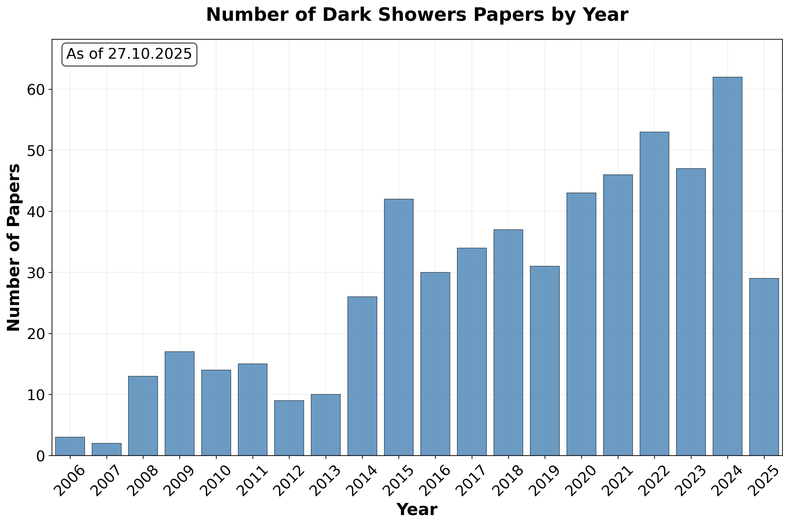

# **A Living Review of Dark Showers**

*Dark showers sit at a rich intersection of theory, phenomenology and experimental efforts. They connect different areas of theoretical physics with each other and arise from well motivated theoretical scenarios. Below is a list of papers concerning dark showers.*

The purpose of this note is to collect references for dark showers. A minimal number of categories is chosen in order to be as useful as possible. Note that papers may be referenced in more than one category.

**Last updated:** 2025-09-22
**Search period:** 2020-01-01 to present
**Total papers found:** 66

## Model Building

* [Field theory axiverse](https://inspirehep.net/literature/2778853)
  * arXiv:2404.11642 | 2024-04-19 | hep-ph
* [Perturbative unitarity of strongly interacting massive particle models](https://inspirehep.net/literature/2159849)
  * arXiv:2210.01393 | 2022-10-05 | hep-ph
* [Theory, phenomenology, and experimental avenues for dark showers: a Snowmass 2021 report](https://inspirehep.net/literature/2054250)
  * arXiv:2203.09503 | 2022-03-18 | hep-ph
* [A theory of dark pions](https://inspirehep.net/literature/1949029)
  * arXiv:2110.10691 | 2021-10-22 | hep-ph

## Dark Matter

* [Inelastically Decoupling Dark Matter](https://inspirehep.net/literature/2958244)
  * arXiv:2508.04772 | 2025-08-08 | hep-ph
* [Dark showers from sneaky dark matter](https://inspirehep.net/literature/2851201)
  * arXiv:2411.15073 | 2024-11-25 | hep-ph
* [Dark matter in QCD-like theories with a theta vacuum: Cosmological and astrophysical implications](https://inspirehep.net/literature/2787890)
  * arXiv:2405.10367 | 2024-05-20 | hep-ph
* [Composite dark matter with forbidden annihilation](https://inspirehep.net/literature/2774597)
  * arXiv:2404.03963 | 2024-04-08 | hep-ph
* [Dark matter relic density in strongly interacting dark sectors with light vector mesons](https://inspirehep.net/literature/2727942)
  * arXiv:2311.17157 | 2023-11-30 | hep-ph
* [Indirect detection of Dark Matter annihilating into Dark Glueballs](https://inspirehep.net/literature/2181023)
  * arXiv:2211.05794 | 2022-11-14 | hep-ph
* [Linear sigma dark matter](https://inspirehep.net/literature/2083203)
  * arXiv:2205.08088 | 2022-05-18 | hep-ph
* [Dark matter self-interactions in the matter power spectrum](https://inspirehep.net/literature/2012042)
  * arXiv:2201.06551 | 2022-01-19 | hep-ph
* [Dark matter freeze-out during SU(2)$_{L}$ confinement](https://inspirehep.net/literature/1992970)
  * arXiv:2112.09152 | 2021-12-20 | hep-ph
* [Dark unification: A UV-complete theory of asymmetric dark matter](https://inspirehep.net/literature/1991967)
  * arXiv:2112.08374 | 2021-12-17 | hep-ph
* [Leptophilic composite asymmetric dark matter and its detection](https://inspirehep.net/literature/1858239)
  * arXiv:2104.06988 | 2021-04-15 | hep-ph
* [Composite Dark Matter from Strongly-Interacting Chiral Dynamics](https://inspirehep.net/literature/1813254)
  * arXiv:2008.10607 | 2020-08-26 | hep-ph
* [Maximally self-interacting dark matter: models and predictions](https://inspirehep.net/literature/1809511)
  * arXiv:2007.15522 | 2020-07-31 | hep-ph

## Experimental

* [Searching for leptophilic composite asymmetric dark sector at $e^+e^-$ colliders](https://inspirehep.net/literature/2970000)
  * arXiv:2509.12504 | 2025-09-17 | hep-ph
* [Searching for Dark Pions with the MoEDAL-MAPP Detector at the LHC](https://inspirehep.net/literature/2966334)
  * arXiv:2509.02821 | 2025-09-04 | hep-ph
* [New Physics Search at the CEPC: a General Perspective](https://inspirehep.net/literature/2927088)
  * arXiv:2505.24810 | 2025-06-02 | hep-ex
* [Hidden Valleys in the CMS muon endcap detector](https://inspirehep.net/literature/2918574)
  * arXiv:2505.03058 | 2025-05-07 | hep-ph
* [Search for new physics in final states with semivisible jets or anomalous signatures using the ATLAS detector](https://inspirehep.net/literature/2918816)
  * arXiv:2505.01634 | 2025-05-07 | hep-ex
* [Search for emerging jets in pp collisions at $\sqrt{s} = 13.6$ TeV with the ATLAS experiment](https://inspirehep.net/literature/2918800)
  * arXiv:2505.02429 | 2025-05-07 | hep-ex
* [Prompt searches for feebly interacting particles at the LHC](https://inspirehep.net/literature/2857293)
  * arXiv:2412.06297 | 2024-12-10 | hep-ex
* [SHIFT@LHC: Searches for new physics with shifted interaction on a fixed target at the Large Hadron Collider](https://inspirehep.net/literature/2797726)
  * arXiv:2406.08557 | 2024-06-14 | hep-ph
* [Search for dark mesons decaying to top and bottom quarks in proton-proton collisions at $ \sqrt{\textrm{s}} $ = 13 TeV with the ATLAS detector](https://inspirehep.net/literature/2791856)
  * arXiv:2405.20061 | 2024-05-31 | hep-ex
* [Search for Soft Unclustered Energy Patterns in Proton-Proton Collisions at 13 TeV](https://inspirehep.net/literature/2766846)
  * arXiv:2403.05311 | 2024-03-11 | hep-ex
* [Two-particle angular correlations in the search for new physics at future $e^+e^-$ colliders](https://inspirehep.net/literature/2682330)
  * arXiv:2307.14734 | 2023-07-28 | hep-ph
* [Energetic long-lived particles in the CMS muon chambers](https://inspirehep.net/literature/2651100)
  * arXiv:2304.06109 | 2023-04-14 | hep-ph
* [Scouting for dark showers at CMS and LHCb](https://inspirehep.net/literature/2639393)
  * arXiv:2303.04167 | 2023-03-09 | hep-ph
* [LHC lifetime frontier and visible decay searches in composite asymmetric dark matter models](https://inspirehep.net/literature/1982942)
  * arXiv:2112.01202 | 2021-12-03 | hep-ph
* [Searching for hidden matter with long-range angular correlations at $e^+e^-$ colliders](https://inspirehep.net/literature/1942128)
  * arXiv:2110.05900 | 2021-10-13 | hep-ph
* [Unleashing the full power of LHCb to probe stealth new physics](https://inspirehep.net/literature/1865621)
  * arXiv:2105.12668 | 2021-05-27 | hep-ph
* [Perturbative benchmark models for a dark shower search program](https://inspirehep.net/literature/1849561)
  * arXiv:2103.01238 | 2021-03-03 | hep-ph
* [Searches for low-mass dimuon resonances](https://inspirehep.net/literature/1805777)
  * arXiv:2007.03923 | 2020-07-09 | hep-ex

## Machine Learning

* [Probing dark QCD sector through the Higgs portal with machine learning at the LHC](https://inspirehep.net/literature/2649630)
  * arXiv:2304.03237 | 2023-04-07 | hep-ph

## New Signatures

* [Topological Freeze-out by Semi-Annihilation](https://inspirehep.net/literature/2931444)
  * arXiv:2506.05468 | 2025-06-09 | hep-ph
* [On the simulation of hidden parton showers in the conformal window](https://inspirehep.net/literature/2894869)
  * arXiv:2502.18566 | 2025-02-27 | hep-ph
* [Flavor physics at the CEPC: a general perspective*](https://inspirehep.net/literature/2863363)
  * arXiv:2412.19743 | 2024-12-30 | hep-ex
* [Semi-visible jets + X: illuminating dark showers with radiation](https://inspirehep.net/literature/2826356)
  * arXiv:2409.04741 | 2024-09-10 | hep-ph
* [Phenomenology of electroweak portal dark showers: high energy direct probes and low energy complementarity](https://inspirehep.net/literature/2822698)
  * arXiv:2408.13304 | 2024-08-29 | hep-ph
* [Dark sector showers and hadronisation in Herwig 7](https://inspirehep.net/literature/2819135)
  * arXiv:2408.10044 | 2024-08-20 | hep-ph
* [Exploring the hidden valley at MATHUSLA](https://inspirehep.net/literature/2818246)
  * arXiv:2408.07756 | 2024-08-16 | hep-ph
* [Topological Portal to the Dark Sector](https://inspirehep.net/literature/2748742)
  * arXiv:2401.09528 | 2024-01-19 | hep-ph
* [Dark showers from Z-dark Z′ mixing](https://inspirehep.net/literature/2747766)
  * arXiv:2401.08785 | 2024-01-18 | hep-ph
* [Exploring hidden sectors with two-particle angular correlations at future $e^{+}e^{-}$ colliders](https://inspirehep.net/literature/2734725)
  * arXiv:2312.06526 | 2023-12-12 | hep-ph
* [Non-resonant anomaly detection with background extrapolation](https://inspirehep.net/literature/2725444)
  * arXiv:2311.12924 | 2023-11-23 | hep-ph
* [Bridging the μHz gap in the gravitational-wave landscape: unveiling dark baryons](https://inspirehep.net/literature/2723915)
  * arXiv:2311.10449 | 2023-11-20 | hep-ph
* [Heavy Neutral Leptons via Axionlike Particles at Neutrino Facilities](https://inspirehep.net/literature/2722318)
  * arXiv:2311.07713 | 2023-11-15 | hep-ph
* [Emerging jet probes of strongly interacting dark sectors](https://inspirehep.net/literature/2676024)
  * arXiv:2307.04847 | 2023-07-12 | hep-ph
* [Triggering dark showers with conditional dual auto-encoders](https://inspirehep.net/literature/2670811)
  * arXiv:2306.12955 | 2023-06-23 | hep-ex
* [SIMPly add a dark photon](https://inspirehep.net/literature/2622298)
  * arXiv:2301.04513 | 2023-01-12 | hep-ph
* [2B or not $^{2}$B, a study of bottom-quark-philic semi-visible jets](https://inspirehep.net/literature/2106068)
  * arXiv:2207.01885 | 2022-07-06 | hep-ph
* [The Physics potential of the CEPC. Prepared for the US Snowmass Community Planning Exercise (Snowmass 2021)](https://inspirehep.net/literature/2084168)
  * arXiv:2205.08553 | 2022-05-19 | hep-ph
* [Forecasting dark showers at Belle II](https://inspirehep.net/literature/2054069)
  * arXiv:2203.08824 | 2022-03-18 | hep-ph
* [Simulating glueball production in <math display="inline"><msub><mi>N</mi><mi>f</mi></msub><mo>=</mo><mn>0</mn></math> QCD](https://inspirehep.net/literature/2039371)
  * arXiv:2202.12899 | 2022-03-01 | hep-ph
* [Emerging jets displaced into the future](https://inspirehep.net/literature/1987829)
  * arXiv:2112.05690 | 2021-12-13 | hep-ph
* [New Approaches to the Hierarchy Problem and their Signatures from Microscopic to Cosmic Scales](https://inspirehep.net/literature/1869328)
  * arXiv:2009.11870 | 2021-06-21 | hep-ph
* [Dark QCD matters](https://inspirehep.net/literature/1862522)
  * arXiv:2105.03429 | 2021-05-10 | hep-ph
* [The muon Smasher’s guide](https://inspirehep.net/literature/1854006)
  * arXiv:2103.14043 | 2021-03-29 | hep-ph
* [Triggering on emerging jets](https://inspirehep.net/literature/1851910)
  * arXiv:2103.08620 | 2021-03-17 | hep-ph
* [Collider constraints on dark mediators](https://inspirehep.net/literature/1834020)
  * arXiv:2011.13990 | 2020-12-01 | hep-ph
* [Morphology for jet classification](https://inspirehep.net/literature/1826209)
  * arXiv:2010.13469 | 2020-10-27 | hep-ph
* [Exploring jet substructure in semi-visible jets](https://inspirehep.net/literature/1808515)
  * arXiv:2007.11597 | 2020-07-24 | hep-ph
* [Casting a graph net to catch dark showers](https://inspirehep.net/literature/1801423)
  * arXiv:2006.08639 | 2020-06-17 | hep-ph
* [Producing and detecting long-lived particles at different experiments at the LHC](https://inspirehep.net/literature/1791806)
  * arXiv:2004.08820 | 2020-04-21 | hep-ph

